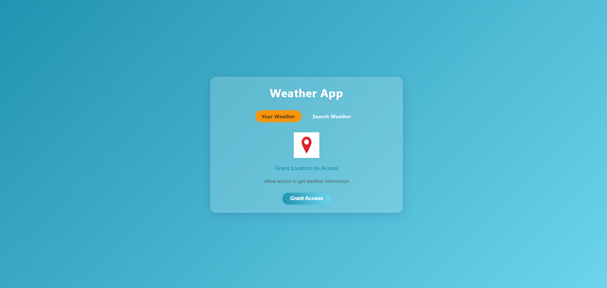

# Weather App

A simple weather application built with HTML, CSS, and JavaScript that allows users to view the current weather for their location or search for weather information by city name.

## Features

- Get weather for your current location (using browser geolocation)
- Search weather by city name
- Displays temperature, weather description, wind speed, humidity, and cloudiness
- Responsive and modern glassmorphism UI

## Screenshots




## Getting Started

### Prerequisites

- A modern web browser
- Internet connection (to fetch weather data from OpenWeatherMap API)

### Installation

1. Clone or download this repository.
2. Open `index.html` in your browser.

### Usage

- Click **"Your Weather"** to get weather for your current location (allow location access).
- Click **"Search Weather"** to search for weather by city name.

## Project Structure

```
index.html
style.css
script.js
assets/
    cloud.png
    clouds.png
    humidity.png
    loading (1).gif
    location.png
    search.png
    wind.png
```

- `index.html` - Main HTML file
- `style.css` - Styling for the app
- `script.js` - JavaScript logic for fetching and displaying weather
- `assets/` - Icons and images used in the app

## API

This app uses the [OpenWeatherMap API](https://openweathermap.org/api) to fetch weather data.

## License

This project is for educational purposes.